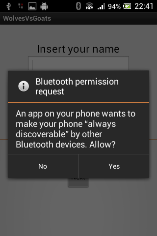
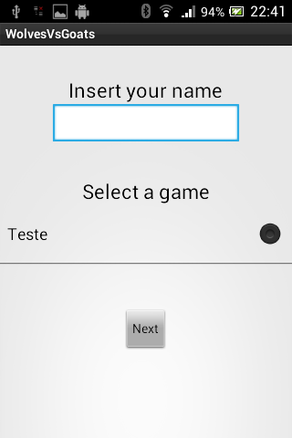
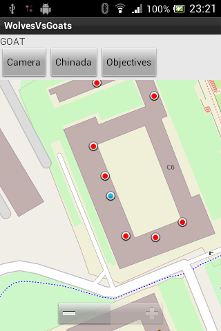
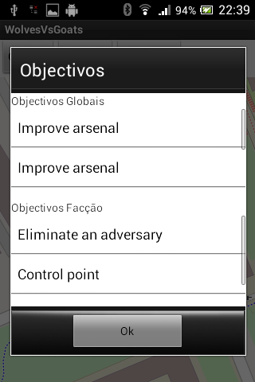
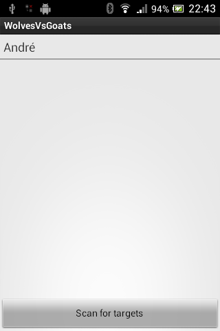
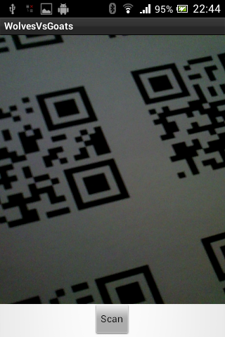

# WolvesVsGoats-Android
Android game with indoor location

# Introdução
Foi proposto no inicio do semestre um jogo multi-utilizador chamado &quot;Wolves vs Goats&quot; que envolve uma área abrangente de jogo e pelo menos 10 jogadores (aconselhado para ser mais interessante). Os participantes devem estar munidos de um telemóvel android capaz de se ligar a uma rede local, GPS, bluetooth, câmara, acelerómetro e compasso. Aconselhamos a utilização de auscultadores para uma experiência mais envolvente. Cada jogador sabe a sua localização a partir de coordenadas GPS e triangulação wi-fi.

# Descrição do Jogo proposto
Existem duas facções. Cada jogador sabe a que facção pertence mas não sabe quem são os seus aliados ou inimigos. Todos os jogadores têm dois tipos de objectivos, um conjunto de objectivos igual para todos os jogadores e um objectivo de facção de cada vez. Os objectivos gerais servem para os jogadores interagirem e terem maneira de descobrir quem são os seus aliados/adversários sem revelarem qual é o objectivo de facção. Os objectivos de facção servem para ganhar o jogo; cada facção terá (cerca de) 10 objectivos.
Antes de começar o jogo é necessário distribuir um conjunto de QR-codes pela área de jogo. Quando cada QR-code é colocado sinaliza-se ao servidor a sua posição e sinaliza-se quando estiverem todos colocados. Todos os jogadores irão descobrir a localização de cada QR-code através de objectivos ou exploração; o conteúdo de cada QR-code é atribuído aleatoriamente pelo servidor. Os QR-code servirão como pontos para cumprir objectivos, como caches de abastecimento de armas ou podem estar vazios e em certos casos os jogadores podem colocar armadilhas. As armadilhas são obtidas como recompensas de objectivos cumpridos ou a partir de caches. As armadilhas podem ser colocadas em QR-codes vazios; cada facção tem um único jogador que pode detectar armadilhas.
Quando um jogador tiver inimigos por perto aparecerá um aviso de inimigos nas proximidades. O aviso não indicará quantos inimigos, apenas a sua presença. Um jogador poderá tentar eliminar outro usando o seu android como faca e simular um golpe ao adversário. Este golpe tem de ser dado próximo do adversário e elimina imediatamente o jogador alvo, quer seja aliado ou inimigo. Por isso, convém ter a certeza que o jogador é mesmo um inimigo! Se o jogador eliminado for um detector de armadilhas o jogador que o eliminou passa a ter a habilidade de encontrar armadilhas (como se roubasse o detector). Por isso e possível uma facção ter dois detectores.
Uma facção ganha o jogo quando elimina todos os adversários ou quando cumpre todos os objectivos de facção.

# Funcionalidades implementadas
- Re-implementámos Triangulação Wi-Fi:
  - Seleccionam-se as três antenas Wi-fi com sinal mais forte. Efectua-se a bilateração entre cada par de modo a obter três pontos com posição mais aproximada. De seguida calcula-se o centro do triângulo, obtendo a posição do jogador.
- Localização Wi-Fi com duas antenas (bilateração):
  - Usando a força do sinal de duas antenas calcula-se a sua posição aproximada e a posição do jogador é a média dessas posições.
- Servidor central:
  - Concretizado com Threads e ligações TCP.
- Comunicação de rede (usando TCP):
  - Estabelecer ligações TCP entre os telemóveis dos jogadores e o servidor central.
- Mapa e exibição de posição actual do jogador e dos objectivos:
  - Usando Open Street Maps e mostrando a azul a posição do jogador e a vermelho as posições dos seus objectivos.
- Atacar outros jogadores usando bluetooth, giroscópio e comunicação de rede (&quot;chinada&quot;):
  - Quando um jogador entra no modo de ataque, procura-se por bluetooth jogadores nas proximidades. Se um jogador estiver muito próximo de outro poderá atacar (medido por sinal bluetooth). A identidade do jogador é questionada ao servidor para obter o nome de jogo e não o nome associado ao bluetooth do adversário. Se o jogador decidir atacar outro então terá de o fazer rápido (não pode deixar o alvo afastar-se e depois atacar). Se o ataque for bem sucedido o jogador alvo é eliminado do jogo.
- Leitura e interpretação de QR-Codes:
  - Usando câmara e leitura dos valor associado. O valor é enviado ao servidor para interpretação do seu significado. Os QR-Codes foram gerados especificamente para o jogo (em anexo).
- Eliminação de jogadores:
  - Utilizando a &quot;chinada&quot;.
- Cumprimento de objectivos globais/facção:
  - Utilizando a &quot;chinada&quot; ou leitura de QR-Codes.
- Som das armas usadas:
  - Usando a biblioteca de áudio da API do Android.
- Selecção de jogos disponíveis:
  - Pedido ao servidor que jogos estão a decorrer.
- Listagem de objectivos globais/facção:
  - No ecrã principal de jogo é possível invocar um pop-up que mostra os objectivos por cumprir.

# Modo de funcionamento

# Dificuldades encontradas
A nossa principal dificuldade foi na parte de ligação de rede, pois as configurações da rede Eduroam praticamente não permitem a utilização de UDP, e a rede é demasiado pouco fiável para existir sempre uma ligação TCP. Além disso o funcionamento do Android dificulta a utilização de esquemas de rede mais complexos, como é o nosso caso. O esquema de rede actual é a terceira tentativa, e mesmo assim a versão actual quase não possui robustez.

# Trabalho futuro
Implementar as funcionalidades que faltam e incluir mais complexidade no jogo ao nível dos objectivos e diferenciação de armas.

### Funcionalidades por implementar (por falta de tempo)
- Uso do compasso;
- Maioria dos sons;
- Proximidade de adversários;
- Cores a distinguir os diferentes objectivos;
- Presença do jogador &quot;Alce&quot;;
- Fim do jogo;

# License
 <a xmlns:cc="http://creativecommons.org/ns#" href="http://wvg.i3portal.net" property="cc:attributionName" rel="cc:attributionURL">Wolves Vs Goats</a> by <a href="http://about.me/andrer757">André Rosa</a> e Fernando Alves is licensed under a <a rel="license" href="http://creativecommons.org/licenses/by-nc-sa/3.0/deed.en_US">Creative Commons Attribution-NonCommercial-ShareAlike 3.0 Unported License</a>. Based on a work at <a xmlns:dct="http://purl.org/dc/terms/" href="https://github.com/Andrer757/WolvesVsGoats" rel="dct:source">https://github.com/Andrer757/WolvesVsGoats</a>.